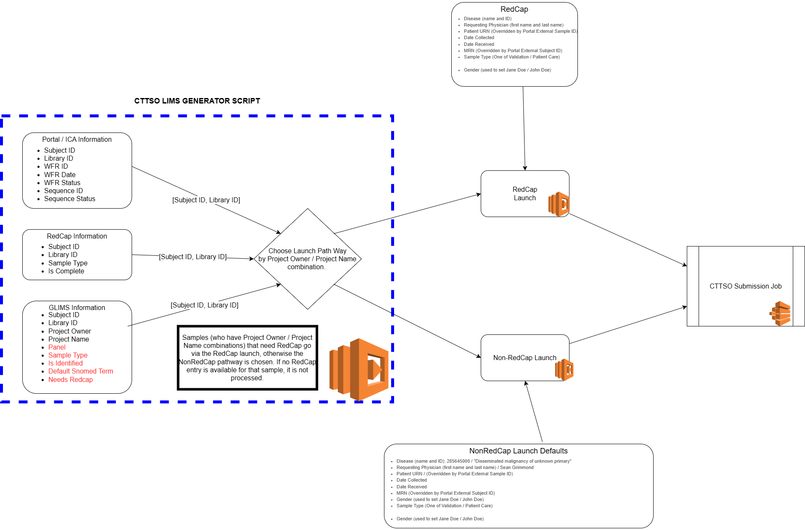

# Welcome to the CDK V2 for cttso-ica-to-pieriandx in typescript

## Getting started

This AWS CDK project comprises two AWS CodePipeline stacks 'dev' and 'prod' that are both deployed into the UMCCR Bastion account. 

If the 'dev' GitHub branch of this repo is pushed to, the dev codepipeline stack is automatically deployed and updated. 

If the 'main' GitHub branch of this repo is pushed to, the prod codepipeline stack requires a user to press the 'approval' step in the AWS CodePipeline UI. 

## Helpful Pointers

The bulk of the CDK logic resides in the 'lib' directory and is called by the 'bin' directory. 

Code constants are held in _constants.ts_.

AWS SSM Parameters for the dev pipeline stack can be found in _params-dev.json_.

AWS SSM Parameters for the prod pipeline stack can be found in _params-prod.json_.

## Initialising the ctTSO LIMS

If the lims sheet needs to be rebuilt, then the following steps may be of use.

Open up a python console and run the following:

```python3
from lambda_utils.gspread_helpers import set_google_secrets
from gspread_pandas import Spread
import pandas as pd

# Set google secrets
set_google_secrets()

# Create the new spreadsheet
new_spread = Spread(spread="ctTSO LIMS", 
                    sheet="Sheet1", 
                    create_spread=True)

new_headers = [
    "subject_id",
    "library_id",
    "in_glims",
    "in_portal",
    "in_redcap",
    "in_pieriandx",
    "glims_project_owner",
    "glims_project_name",
    "glims_panel",
    "glims_sample_type",
    "glims_is_identified",
    "glims_default_snomed_term",
    "glims_needs_redcap",
    "redcap_sample_type",
    "redcap_is_complete",
    "portal_wfr_id",
    "portal_wfr_end",
    "portal_wfr_status",
    "portal_sequence_run_name",
    "portal_is_failed_run",
    "pieriandx_submission_time",
    "pieriandx_case_id",
    "pieriandx_case_accession_number",
    "pieriandx_case_creation_date",
    "pieriandx_case_identified",
    "pieriandx_assignee",
    "pieriandx_disease_code",
    "pieriandx_disease_label",
    "pieriandx_panel_type",
    "pieriandx_sample_type",
    "pieriandx_workflow_id",
    "pieriandx_workflow_status",
    "pieriandx_report_status"
]

headers_df = pd.DataFrame(columns=new_headers)

new_spread.df_to_sheet(headers_df, headers=True, index=False, replace=True)

# Auth update
# Allow users to read
new_spread.add_permission(
    "all@umccr.org|reader"
)

# Allow yourself to edit
# You may need to manually add extra rows as some point
new_spread.add_permission(
    "alexis.lucattini@umccr.org|writer"
)

# Show url - to set ssm parameter
print(new_spread.url)
```

## ctTSO LIMS Decision Tree

Please see [#validation-or-clinical-script](#validation-or-clinical-script) for more information.

### Overview

> The following diagram may be of assistance




## Helpful scripts

### ./scripts/update-params.sh

To update a ssm parameter, edit the respective _params.json_ and log into the appropriate AWS account. 

Run `update-params.sh` in your console and changed ssm parameters will be updated.

### ./scripts/update-pieriandx-password.sh

The PierianDx password must be updated every three months and is a manual process. 

This requires the user to log in to [app.pieriandx.com](https://app.pieriandx.com) and update their password.

The new password should be 20 characters and contain lowercase, uppercase and numbers (no symbols)! 

Once updated in PierianDx, the user should run the update-pieriandx-password.sh in **both the dev and prod accounts**.  

This will prompt the user for the new password and will update the AWS secretsmanager respectively.

The script will also test that the new password can successfully create a new PierianDx Auth token.  

One should also update the password in [KeyBase](https://keybase.io/) under 'vccc.umccr.admin/pieriandx_service_user.txt'

### ./scripts/launch_direct_cttso_lambda_from_glims

To update the direct payloads from Google LIMS this script asks the user to provide a subject ID and library ID
in order to trigger the cttso submission collecting all the available data from Google LIMS. 

### ./scripts/launch_clinical_payloads

In order to trigger a pieriandx run the launch payloads for clinical samples script, which takes in a list of json strings via a file.

An example of the payloads file is as below:

```json lines
{ "subject_id": "SBJ12345", "library_id": "L000123", "ica_workflow_run_id": "wfr.abcdef123456" }
{ "subject_id": "SBJ67890", "library_id": "L000456", "ica_workflow_run_id": "wfr.a1b2c3d4e5f6" }
```

And then launch like so

```bash
./scripts/launch_clinical_payloads --payloads-file "payloads.jsonl"
```

Please note that the ica_workflow_run_id value is the "TSO_CTDNA_TUMOR_ONLY" workflow id. 
It can also be found by hunting for the library id in biobots?

### ./scripts/launch_validation_payloads

In order to trigger a pieriandx run the launch payloads for validation samples script, which takes in a list of json strings via a file.
An example of the payloads file is as below:

```json lines
{ "subject_id": "SBJ12345", "library_id": "L000123", "ica_workflow_run_id": "wfr.abcdef123456" }
{ "subject_id": "SBJ67890", "library_id": "L000456", "ica_workflow_run_id": "wfr.a1b2c3d4e5f6" }
```

And then launch like so

```bash
./scripts/launch_validation_payloads --payloads-file "payloads.jsonl"
```

### ./scripts/wake_up_lambdas

Lambdas sometimes go to sleep if they haven't been used for a few days, if you run either of the launch payload scripts
above and you get an error stating that you need to wake up the lambdas before launching, please run this and wait
for its completion.

## Running payloads manually (step-by-step) tutorial

### When is this necessary?

A manual push may be required when a sample is not triggered by the lims sheet above OR  
a user wants to run a sample through the development account, which does not contain a LIMS 
sheet.  

### Required installations

* [yawsso][yawsso]
* [aws-cli v2][aws_cli_v2]
* [ica-ica-lazy][ica_ica_lazy]
* [git][git]

### Logging in to AWS  

Use aws sso to login.  

You will need to log into the production account if you are running a sample through the production
pieriandx pipeline. Check `~/.aws/config` to determine your production profile name.  

Let's then use yawsso to ensure our command line is using the production account.  

We can run `aws sts get-caller-identity` to confirm which account is being invoked.

More information on using AWS at UMCCR can be found [here][aws_umccr_wiki]

```
aws sso login --profile prod

. <(yawsso -e -p prod)

aws sts get-caller-identity
```

### Cloning this git repo

You will need to clone this repo to your local desktop in order to run the launch payloads script.

```
# For git users under the umccr organisation
git clone git@github.com:umccr/cttso-ica-to-pieriandx
# Otherwise run 
# git clone https://github.com/umccr/cttso-ica-to-pieriandx
```

Change into the repo directory

```
cd cttso-ica-to-pieriandx
```

Make sure you're in the main branch and the latest changes have been pulled
```
git checkout main
git pull
```

Now change to the deployment directory (the directory this readme is in)

```
cd deploy/cttso-ica-to-pieriandx-cdk
```

### Wake up lambdas!

Before we launch any payloads, let's ensure that the lambda (and any downstream lambdas)
are active.

```
./scripts/wake_up_lambdas.sh
```

### Collecting the ICA workflow run ID 

This part assumes you've created an access token and access the production project context. 

By running the following, you should be able to see the latest workflow runs.

```
ica-context-switcher --scope read-only --project-name production
ica workflows runs list
```
 
CTTSO workflow runs will have the prefix _umccr__automated__tso_ctdna_tumor_only_.  

Find the workflow with the subject id and library id of interest in the workflow run name and note the workflow id.  

### Validation or clinical script

Use the Google LIMS page to check if you're sample is a validation sample (ProjectName field is either _control_ or _validation_).  
Validation samples do not go through the subpanel pipeline, clinical samples go through the subpanel pipeline.

We use the following JSON logic to determine the pathway for each pieriandx sample based on it's project owner 

This file can be found in `project-name-to-pieriandx-mapping.json`.  

The mapping can be updated with the script `update_project_name_mapping.sh`.  

This ssm parameter is NOT part of the cdk stack and MUST be updated using the script above.  

```json
[
  {
    "project_owner": "VCCC",
    "project_name": "PO",
    "panel": "subpanel",
    "sample_type": "patient_care_sample",
    "is_identified": "identified",
    "default_snomed_term":null
  },
  {
    "project_owner": "Grimmond",
    "project_name": "COUMN",
    "panel": "subpanel",
    "sample_type": "patient_care_sample",
    "is_identified": "identified",
    "default_snomed_term": null
  },
  {
    "project_owner": "Tothill",
    "project_name": "CUP",
    "panel": "main",
    "sample_type": "patient_care_sample",
    "is_identified": "identified",
    "default_snomed_term": "Disseminated malignancy of unknown primary"
  },
  {
    "project_owner": "Tothill",
    "project_name": "PPGL",
    "panel": "main",
    "sample_type": "patient_care_sample",
    "is_identified": "identified",
    "default_snomed_term": null
  },
  {
    "project_owner": "TJohn",
    "project_name": "MESO",
    "panel": "subpanel",
    "sample_type": "patient_care_sample",
    "is_identified": "identified",
    "default_snomed_term": null
  },
  {
    "project_owner": "TJohn",
    "project_name": "OCEANiC",
    "panel": "subpanel",
    "sample_type": "patient_care_sample",
    "is_identified": "deidentified",
    "default_snomed_term": null
  },
  {
    "project_owner": "*",
    "project_name": "SOLACE2",
    "panel": "main",
    "sample_type": "patient_care_sample",
    "is_identified": "deidentified",
    "default_snomed_term": "Neoplastic disease"
  },
  {
    "project_owner": "SLuen",
    "project_name": "IMPARP",
    "panel": "main",
    "sample_type": "patient_care_sample",
    "is_identified": "deidentified",
    "default_snomed_term": "Neoplastic disease"
  },
  {
    "project_owner": "UMCCR",
    "project_name": "Control",
    "panel": "main",
    "sample_type": "validation",
    "is_identified": "deidentified",
    "default_snomed_term": "Neoplastic disease"
  },
  {
    "project_owner": "UMCCR",
    "project_name": "QAP",
    "panel": "subpanel",
    "sample_type": "patient_care_sample",
    "is_identified": "identified",
    "default_snomed_term": null
  },
  {
    "project_owner": "*",
    "project_name": "*",
    "panel": "main",
    "sample_type": "patient_care_sample",
    "is_identified": "deidentified",
    "default_snomed_term": "Neoplastic disease"
  }
]
```

### Creating the input payloads file

Regardless of panel type, payloads will in jsonl format with each line comprising the following keys:

* subject_id
* library_id
* ica_workflow_run_id

An example payloads file can be seen under [examples](examples/).

### Running the command

For validation samples, run the following command
```
./scripts/launch_validation_payloads --payloads-file "payloads.jsonl"
```

For clinical samples run the following command

```
./scripts/launch_clinical_payloads --payloads-file "payloads.jsonl"
```

### Troubleshooting

#### An error occurred (AccessDeniedException) when calling the Invoke operation:

If you come across an error at launch stage, 

```
User: ... is not authorized to perform: lambda:InvokeFunction on resource: 
arn:aws:lambda:ap-southeast-2:472057503814:function:cttso-ica-to-pieriandx-prod-redcap-lambda-stack-lf 
because no identity-based policy allows the lambda:InvokeFunction action
```

then it's likely a permissions issue. Please talk to your account administrator to elevate your permissions 
before trying again.


[yawsso]:  https://github.com/victorskl/yawsso
[aws_cli_v2]: https://docs.aws.amazon.com/cli/latest/userguide/getting-started-install.html
[ica_ica_lazy]: https://github.com/umccr/ica-ica-lazy
[git]: https://git-scm.com/
[aws_umccr_wiki]: https://github.com/umccr/wiki/blob/master/computing/cloud/amazon/README.md